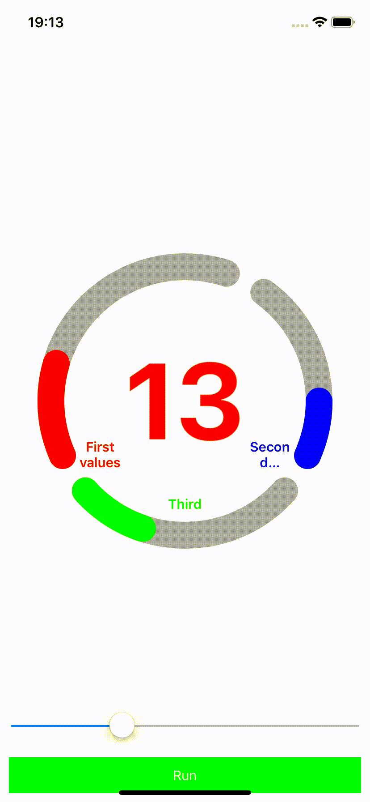

# tripleBar
Swift arc triple progress bar

[](http://cocoapods.org/pods/LinearProgressBar)
[](http://cocoapods.org/pods/LinearProgressBar)
[](http://cocoapods.org/pods/LinearProgressBar)

## Features

- UIBezierPath Triple Progress Bar
- Main arc grow clockwise two another - opposite
- Custom color, custom central label size
- Max value for main arc calcilated from percent to number for main label
- Description labels for each arc

### Preview


## Usage sample

Prepare progress bars
```swift
let progressBars = ArcaProgressView(frame: CGRect(x: 0, y: 0, width: 330, height: 330))
progressBars.labelSize = 120.0
progressBars.center = self.view.center
self.view.addSubview(progressBars)
```

Set progress bars values
```swift
func sliderSlide(sender: UISlider) {
        progressBars.setProgressOne(to: Double(sender.value/100), withAnimation: false, maxSpeed: 45.0)
        progressBars.setProgressTwo(to: Double(sender.value/100), withAnimation: false)
        progressBars.setProgressThree(to: Double(sender.value/100), withAnimation: false)
    }
 ```
